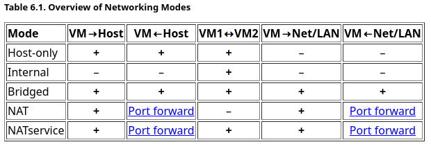

[原文链接](https://mp.weixin.qq.com/s/Lwar7ac7PxuqHdsmRMqg6Q)

一直在使用virtualbox，感觉挺好用的，平时也没怎么遇到过问题，所以也没有详细看过virtualbox的官方文档。

今天突然想要主机访问虚拟机上的服务，发现连不上，ping也ping不通，一脸茫然，所以决定把virtualbox网络这块的文档好好看下。

看完之后，发现还是有很多知识点的，所以写篇文章总结下：

1. virtualbox可选的网络模式有七种，分别是 Not attached、Network Address Translation (NAT)、NAT Network、Bridged networking、Internal networking、Host-only networking、Generic networking。

2. Not attached 模式类似于没插网线，所以网络是断的，没法连接主机和外网，但ip地址什么的是有的。

3. NAT 模式下可以访问主机和外网，但主机、外网及其他虚拟机都不能直接访问该虚拟机，这也是virtualbox的默认网络模式。

4. NAT Network 模式和 NAT 类似，唯一的区别是在该模式下，虚拟机之间可以相互访问。

5. Bridged networking 模式下，虚拟机类似于内网的一台其他机器，所以它可以访问内网中的其他机器以及外网，内网中的其他机器也可以直接访问它，在该模式下，虚拟机之间也是可以访问的。该模式可以说是virtualbox网络功能最全的模式，如果嫌配置网络麻烦，直接用这个模式就好了。

6. Internal networking 模式下，只有虚拟机之间可以相互访问。

7. Host-only networking 模式下，只有虚拟机和主机、虚拟机和虚拟机之间可相互访问。

8. Generic networking 模式很少用，这个不讲。

9. 一台虚拟机可设置多张网卡，比如设置两张网卡，第一张网卡选NAT模式，所以虚拟机可以访问外网，第二张网卡选Host-only networking模式，所以虚拟机可访问主机和其他虚拟机，反之也可以访问。

有关在不同的网络模式下，虚拟机、主机、局域网/外网之间的可访问规则，官方文档给了一个非常好的图表，这里也给大家看下：

有了这个表格做对比，大家就应该能非常清楚的了解各个模式之间的区别了。

好，网络部分的总结就这么多，有关其更详细的介绍，请看官方文档：

https://www.virtualbox.org/manual/ch06.html

希望本文能对你有所帮助。

完。